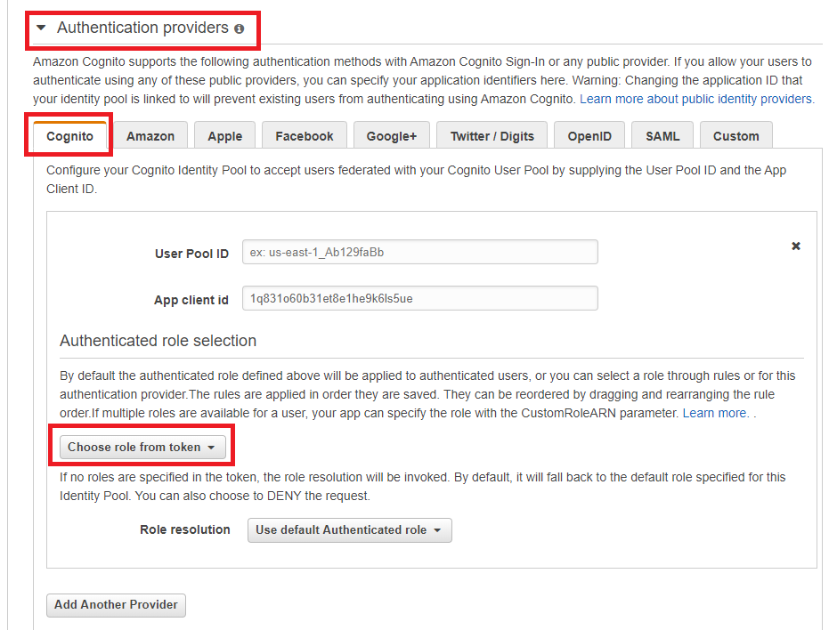
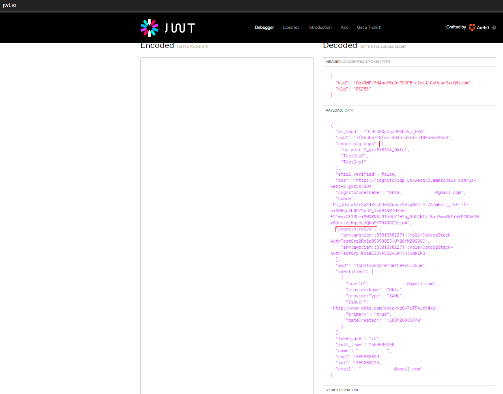
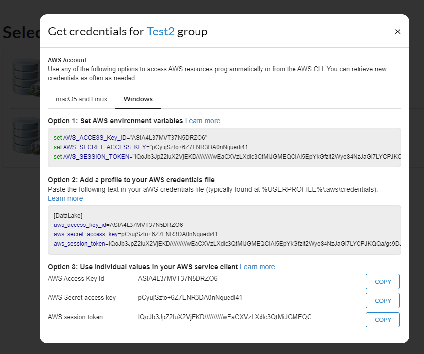
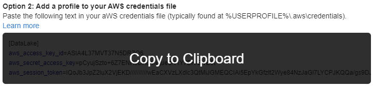
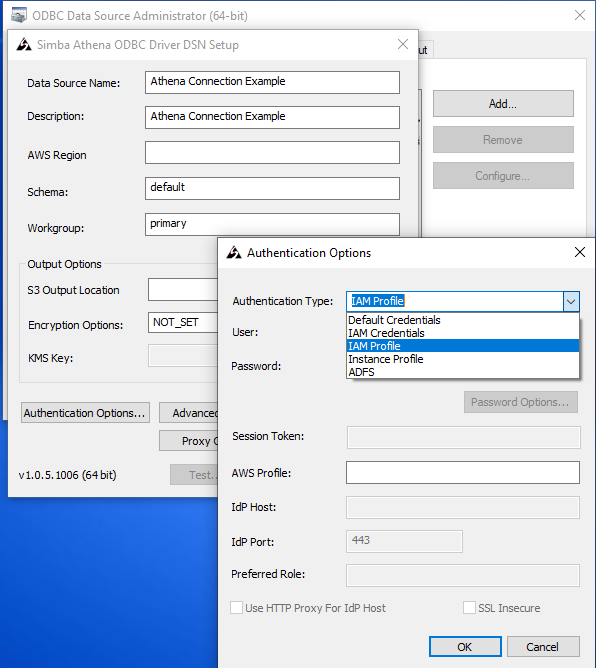

# Providing AWS Credential/Console Access with AWS Cognito
## Overview
This proof of concept (POC) resulted from a need to provide end users access to AWS Athena via a BI tool installed on their laptops. The POC also had the following requirements and constraints:
1.	Support Authentication from multiple IdP sources ([AWS SSO](https://docs.aws.amazon.com/singlesignon/latest/userguide/prereqs.html) only supports a single IdP). End users shall not be given IAM accounts.
2.	Support Authorization through [IAM Web Identity Roles](https://docs.aws.amazon.com/IAM/latest/UserGuide/id_roles_providers_oidc.html) controlled by the data owners of the application and created by the application’s ETL pipeline ([AWS IAM Federation](https://docs.aws.amazon.com/IAM/latest/UserGuide/id_roles_providers.html) would require the IdPs to provide the authorization claims since the trust is configured with the External IdP). 
3.	Allow end users to choose between different [IAM roles](https://docs.aws.amazon.com/cognitoidentity/latest/APIReference/API_GetCredentialsForIdentity.html#CognitoIdentity-GetCredentialsForIdentity-request-CustomRoleArn) at login.
4.	Provide end users with AWS Credentials to connect via Athena ODBC driver. (The [Athena ODBC driver](https://s3.amazonaws.com/athena-downloads/drivers/ODBC/SimbaAthenaODBC_1.0.5/Simba+Athena+ODBC+Install+and+Configuration+Guide.pdf) supports AWS Profiles/IAM Credentials) 
5.	Provide end users the option to [redirect to the AWS Console](https://docs.aws.amazon.com/IAM/latest/UserGuide/id_roles_providers_enable-console-custom-url.html) after login.

This POC uses [AWS CDK](https://github.com/aws/aws-cdk) for the backend and infrastructure, and [React](https://reactjs.org/) for the frontend. 

## Modules
This POC contains the following modules within these sub-folders:
### /cdk
This module is using AWS CDK.
The AWS Cloud Development Kit (AWS CDK) is an open-source software development framework to define cloud infrastructure in code and provision it through AWS CloudFormation.
It defines all the resources needed in order to create the POC application.

The following resources are defined:
* **Amazon API Gateway**: [Amazon API Gateway](https://docs.aws.amazon.com/apigateway/latest/developerguide/welcome.html) is a fully managed service that makes it easy for developers to create, publish, maintain, monitor, and secure APIs at any scale. 
* **AWS Lambda**: [AWS Lambda](https://docs.aws.amazon.com/lambda/latest/dg/welcome.html) *is a compute service that lets you run code without provisioning or managing servers. AWS Lambda executes your code only when needed and scales automatically, from a few requests per day to thousands per second. You pay only for the compute time you consume - there is no charge when your code is not running.* 

    This is the serverless compute service that runs the backend of our app (behind Amazon API Gateway). Requests are only forwarded if the user is authenticated and has a valid JWT token.
    
* **Amazon Cognito User Pools**: [Amazon Cognito User Pools](https://docs.aws.amazon.com/cognito/latest/developerguide/cognito-user-identity-pools.html) *lets you add user sign-up, sign-in, and access control to your web and mobile apps quickly and easily. Amazon Cognito scales to millions of users and supports sign-in with social identity providers, such as Facebook, Google, and Amazon, and enterprise identity providers via SAML 2.0.* 

    In our case, we needed to support 11 different SAML IdPs. Cognito allowed us to add all the SAML IdPs to our Cognito User Pool for **authentication**.  When a user successfully logs into Cognito for the first time using their SAML credentials, Cognito automatically creates a new Cognito account associated with the SAML account. This allowed us to consolidate all IdPs into one **authentication provider**. 
 
* **Amazon Cognito Identity Pools**: [Amazon Cognito Identity  Pools](https://docs.aws.amazon.com/cognito/latest/developerguide/cognito-identity.html)  *(federated identities) enable you to create unique identities for your users and federate them with identity providers. With an identity pool, you can obtain temporary, limited-privilege AWS credentials to access other AWS services.* 

    In our case, we did not want to associate SAML IdPs directly with Cognito Identity Pools as that would require the SAML IdP to also provide the roles the user could assume. We needed to control Authorization from within our Amazon Account. So we chose to use [Cognito User Pools as our Authentication provider](https://docs.aws.amazon.com/cognito/latest/developerguide/amazon-cognito-integrating-user-pools-with-identity-pools.html). 
    
    **Cognito Identity Pool Authentication providers**
    
    
     
    
    Associating our Cognito User Pool to our Cognito Identity Pool allowed us to add a role to each [Cognito User Pool group](https://docs.aws.amazon.com/cognito/latest/developerguide/cognito-user-pools-user-groups.html) we created. When a Cognito user is added to a Cognito User Pool group, a role and group are added to the user's JWT token.
    
    To allow our Cognito Identity Pool to use the Cognito JWT we needed to change the **Authenticated role selection** from "*Use default role*" to "*Choose role from token*".
    
    **Sample JWT Token**
    
    
    
     Once a user logs into Cognito, our Web App receives a JWT token and then submits the JWT with the desired role (CustomRoleArn) to our Cognito identity Pool in exchange for AWS Credentials.

* **Amazon IAM:** [AWS Identity and Access Management (IAM)](https://docs.aws.amazon.com/IAM/latest/UserGuide/introduction.html) *is a web service that helps you securely control access to AWS resources. You use IAM to control who is authenticated (signed in) and authorized (has permissions) to use resources.*

    We used Web identity roles when we setup Roles for our Cognito Groups. The trust policies for these roles had to be set to *AssumeRoleWithWebIdentity* and to [trust our Cognito Identity Pool](https://docs.aws.amazon.com/cognito/latest/developerguide/role-based-access-control.html).
    
* **Amazon CloudFront:** [Amazon CloudFront](https://docs.aws.amazon.com/AmazonCloudFront/latest/DeveloperGuide/Introduction.html) *is a web service that speeds up distribution of your static and dynamic web content, such as .html, .css, .js, and image files, to your users. CloudFront delivers your content through a worldwide network of data centers called edge locations.*
 
    We used CloudFront to host our Web Application. 

* **Amazon SNS:** [Amazon Simple Notification Service (Amazon SNS)](https://docs.aws.amazon.com/sns/latest/dg/welcome.html) *is a web service that coordinates and manages the delivery or sending of messages to subscribing endpoints or clients. In Amazon SNS, there are two types of clients—publishers and subscribers—also referred to as producers and consumers. Publishers communicate asynchronously with subscribers by producing and sending a message to a topic, which is a logical access point and communication channel. Subscribers (that is, web servers, email addresses, Amazon SQS queues, AWS Lambda functions) consume or receive the message or notification over one of the supported protocols (that is, Amazon SQS, HTTP/S, email, SMS, Lambda) when they are subscribed to the topic.* 

    We used SNS to notify User Services when a new user account was added to Cognito and needed its group membership setup. For our POC, we chose email for the subscriber. You could just as easily configure to use JIRA, ServiceNow or Slack.

### /lambda

* #### /lambda/ConsoleSignIn
    This function retrieves the SignInToken from **signin.aws.amazon.com/federation?Action=getSigninToken** needed for the redirect to AWS Console. Using a Lambda function solves the CORS issue.
* #### /lambda/ListGrps
    This function retrieves a listing of Cognito Groups ([AdminListGroupsForUser](https://docs.aws.amazon.com/cognito-user-identity-pools/latest/APIReference/API_AdminListGroupsForUser.html)), their descriptions and their associated RoleArns derived from the JWT token found in the Authorization Header. This Lambda function assumes a role with the following permissions: "cognito-idp:ListUsers", "cognito-idp:AdminListGroupsForUser". 
* #### /lambda/NewUserSNS
    This function is assigned to the [Cognito Post Confirmation trigger](https://docs.aws.amazon.com/cognito/latest/developerguide/user-pool-lambda-post-confirmation.html). It pushes a notification message to an SNS topic announcing a new user. Federated Accounts do not sign-up through Cognito but are automatically added upon successful login to their respective IdP Provider. Thus the Post Confirmation trigger is the best place to tie into a User Services Support system.
 * #### /lambda/SetupMessage
    This function retrieves values both from a user's JWT token and environment variables in Lambda which are used by the Client-side UI to present a welcome message to first-time users and users without assigned groups.

### /ui-react
A simple React frontend that connects to the backend API.
It uses AWS Amplify, which provides react components for simpler integration with various AWS services from web and mobile applications.
AWS Amplify can manage all aspects of a project, but since we used AWS CDK, we followed the [manual setup](https://docs.amplify.aws/lib/auth/start/q/platform/js#re-use-existing-authentication-resource).

#### Client-side Flow
When a user using a external IdP account logs into Cognito for the first time, a new Cognito account is created and associated with the user's external IdP account. A new user does not have groups assigned yet so the client application displays a welcome page.  

1. **Welcome New User Page:**

    

Once a account has Cognito groups assigned to it, the next time the user logs in, the user will be presented with the Select Access page listing the user's groups. 

2. **Select Access Page:**

    

    The user can choose to sign into the AWS Console or get AWS Credentials. This is the [client side code](ui-react%2Fsrc%2Fcode%2FgetConsoleAccess.js) we used to exchange the AWS Credentials for the SignInToken needed to **redirect to the AWS Console**.
    
3. **Get credentials modal page**

    
    
    The format was modeled after the AWS SSO *Get Credentials* modal including the copy to Clipboard option. This is the [client side code](ui-react%2Fsrc%2Fcode%2FgetAWSCreds.js) we used to retrieve **AWS Credentials** from the Cognito Identity Pool. No special IAM permissions are required to access to the [Identity Pool endpoint](https://docs.aws.amazon.com/cognito/latest/developerguide/getting-credentials.html). If a valid JWT is presented it will be processed.
    
4. **Copy to clipboard function**

    
    
5. **Configure Athena Connection**    
    The user can use these credentials to configure their ODBC Athena connection
    
    
    
## Getting Started 
### Pre-requisites
1. An AWS account https://aws.amazon.com/resources/create-account/
2. AWS CLI https://docs.aws.amazon.com/cli/latest/userguide/cli-chap-install.html
3. Configure AWS CLI https://docs.aws.amazon.com/cli/latest/userguide/cli-chap-configure.html
4. Ensure you have the latest node and npm installed https://nodejs.org/en/download/

### Installation
1.	Clone this repo (e.g. git clone https://github.com/kbarber09/amazon-cognito-cdk-example-for-getting-aws-credentials.git)
2. Copy `env.sh.template` to `env.sh` (not recommended to be pushed to your git repo, it's in .gitignore as a protection).
3. Edit `env.sh` and set the values there based on your environment.
4. Edit [./ui-react/src/config/appConfig.js](ui-react%2Fsrc%2Fconfig%2FappConfig.js) and set desired values for the UI application. 
5. Run `./install.sh` which does the following:

    * Installs all node dependencies (it runs npm install in all relevant sub-folders)
    * Builds the project (runs `tsc -b` in each relevant sub-folder - tsc is the TypeScript compiler)
    * Runs `cdk bootstrap` - which creates a stack named CDKToolkit (if it was not created already) that helps simplify managing assets. For more information about assets see [here](https://docs.aws.amazon.com/cdk/latest/guide/assets.html).

    NOTE: 
    - CDK is installed locally to ensure the right version is used. In order to install it globally for use in other projects, run: `$ npm i -g aws-cdk` (see [here](https://github.com/awslabs/aws-cdk#getting-started) for more details)

### Deploying / Updating the Backend Stack
* After installing, run `./deploy.sh` to deploy the backend stack. (For the first time as well as after making changes)
* **IMPORTANT** After first install, you will need to setup your Federation IdP. This step is not included in the CDK backend installation and must be done manually. An IdP must be configured before any logins will succeed. See below under IdP Configuration Instructions for how to install Okta IdP

### IdP Configuration Instructions
* **Okta**:  For our POC, we used [Okta](https://www.okta.com/) for our Federation Identity Provider. Okta is an Access Management and Directory Service Provider offering both SAML and OIDC OpenID Connect options. You can sign-up for a free account. 

    Follow the Okta instructions found here to complete setup: [./docs/OktaInstructions.md](./docs/OktaInstructions.md)
  
### Launching the React UI

* You can run the React App locally (http://localhost:3000) with the following commands:
 
    `cd ui-react` && `npm start` 
 
* You will need to set the **APP_URL** in your `./env.sh` file to **http://localhost:3000** before you deploy the CDK (or rerun `./deploy.sh` to update). For full functionally of the ui-react application, please use CloudFront.

### Other Commands
* Run `./diff.sh` to compare deployed stack with current state
* Run `./synth.sh` to display the generated CloudFormation script from the CDK code
* Run `./build.sh` to compile all packages

## Further Resources

* [How to Easily Identify Your Federated Users by Using AWS CloudTrail](https://aws.amazon.com/blogs/security/how-to-easily-identify-your-federated-users-by-using-aws-cloudtrail/)
 
* [Amazon S3: Allows Federated Users Access to Their S3 Home Directory, Programmatically and In the Console](https://docs.aws.amazon.com/IAM/latest/UserGuide/reference_policies_examples_s3_federated-home-directory-console.html)

* [Amazon S3: Allows Amazon Cognito Users to Access Objects in Their Bucket](https://docs.aws.amazon.com/IAM/latest/UserGuide/reference_policies_examples_s3_cognito-bucket.html)

* [How do I set up Okta as a SAML identity provider in an Amazon Cognito user pool?](https://aws.amazon.com/premiumsupport/knowledge-center/cognito-okta-saml-identity-provider/)

* [Use Amazon QuickSight Federated Single Sign-On with Amazon Cognito User Pools](https://aws.amazon.com/blogs/big-data/use-amazon-quicksight-federated-single-sign-on-with-amazon-cognito-user-pools/)

## License Summary
This Proof of Concept code is made available under the [ISC license](https://opensource.org/licenses/ISC). See the LICENSE file.

