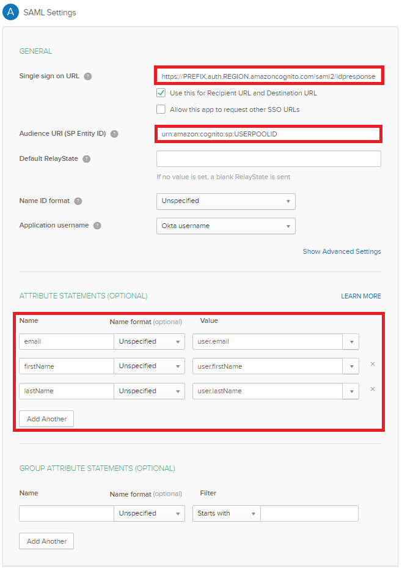
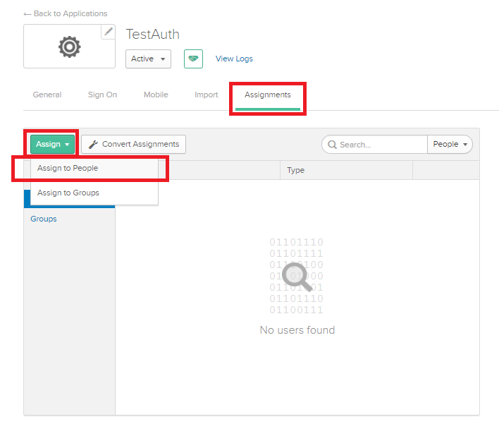
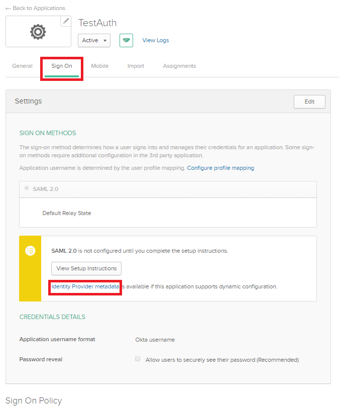
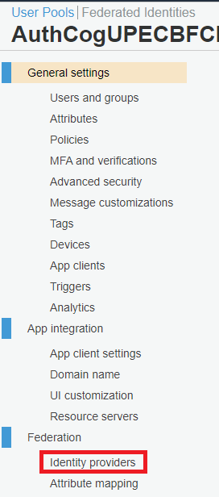
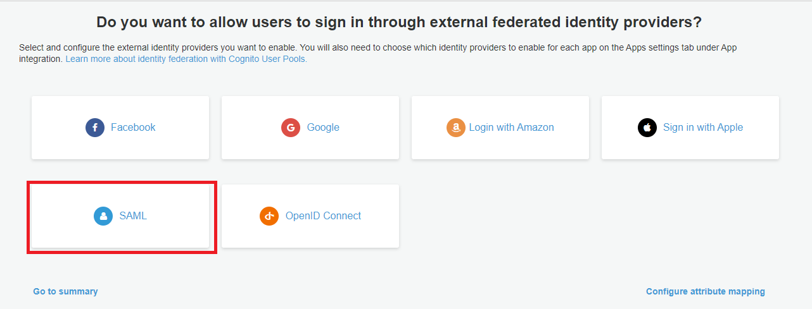
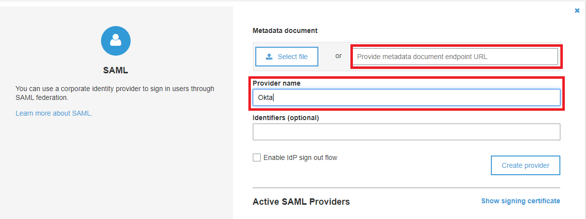
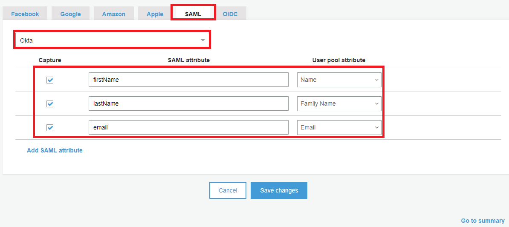
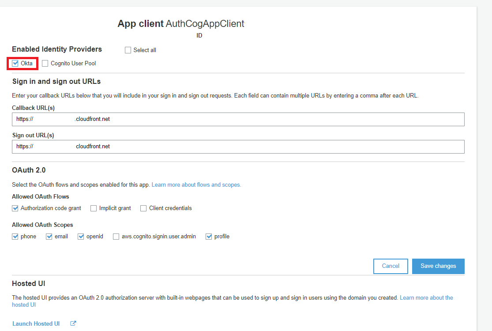

# Integrating IdP Sign In with Cognito
<small>Adapted from https://github.com/aws-samples/amazon-cognito-example-for-external-idp/blob/master/docs/OktaInstructions.md</small>
## Overview

This walkthrough will help guide you through creating a working Okta Application in order to successfully run the POC. 

## Okta Directory and Application Setup

#### If you already have a developer account with Okta, please skip to Step 3

1. Sign up for a developer account on [Okta](https://developer.okta.com/) using your corporate credentials.
2. Activate your account and sign into your Okta domain *stated in the email*.
3. Go to the Admin dashboard by clicking on the **Admin** button on the top-right corner of the page.
4. In the Admin dashboard, go to the top-left of the page where it says **Developer Console** and change it to **Classic UI**.

    

5. On the right-hand side of the page, under **Shortcuts**, click **Add Applications**.

    

6. Select **Create New App** from the left side of the page.

    

7. For Platform, select **Web** and enable **SAML 2.0** for the Sign in method. Then, press **Create**.

    

8. Give the app a name and a logo (*optional*), then select **Next**.

    

9. The next page describes the SAML settings for your app.
10. The **Single sign on URL** will be your Cognito user pool App Integration domain with */saml2/idpresponse* appended.
   * In Cognito, select **Manage User Pools** and then select the user pool for your application
   * On the left side, go to **App integration** and copy the domain
   * If you have already successfully run `./deploy.sh`, you can also find this information in [./ui-react/src/config/autoGenConfig.js](../ui-react%5Csrc%5Cconfig%5CautoGenConfig.js)
   * Example: *https://**yourDomainPrefix**.auth.**yourRegion**.amazoncognito.com/saml2/idpresponse*
11. Make sure the **Use this for Recipient URL and Destination URL** box is checked.
12. For the **Audience URI (SP Entity ID)**, enter the urn for your Cognito user pool. 
    * The user pool ID can be found at the top of the **General Settings** page in your Cognito user pool
    * Example: *urn:amazon:cognito:sp:yourUserPoolID*
13. Leave the **Default RelayState** blank.
14. Select *unspecified* for **Name ID format**.
15. Select *Okta username* for **Application username**.
16. Under **Attribute Statements**, configure the following:

    Name | Name format | Value
    :---: | :---: | :---:
    email | Unspecified | user.email
    firstName | Unspecified | user.firstName
    lastName | Unspecified | user.lastName
   

    

17. We will not configure any groups here as we will create our groups in Cognito instead.
18. Click **Next**.
19. Select *I'm an Okta customer adding an internal app* for **Are you a customer or partner?**.
20. Select *This is an internal app that we have created* for **App Type**.

    

21. Click **Finish**.

#### Assign a user to your Okta application

1. On the Assignments tab for your Okta app, for Assign, choose Assign to People.

    
    
2. Next to the user that you want to assign, choose Assign.
3. Note: If this is a new account, the only option available is to choose yourself (the admin) as the user.
4. (Optional) For User Name, enter a user name, or leave it as the user's email address, if you want.
5. Choose Save and Go Back. Your user is assigned.
6. Choose Done.

#### Get the IdP metadata for your Okta application

* On the Sign On tab for your Okta app, find the Identity Provider metadata hyperlink. Right-click the hyperlink, and then copy the URL.
    
    

#### Configure Okta as a SAML IdP in your user pool
1. In the [Amazon Cognito console](https://console.aws.amazon.com/cognito/), choose Manage user pools, and then choose your user pool.
2. In the left navigation pane, under Federation, choose Identity providers.

    
  
3. Choose SAML.

    

4. Under Metadata document, paste the Identity Provider metadata URL that you copied.
5. For Provider name, enter Okta.

        

6. Choose Create provider.

#### Map Okta IdP attributes to user pool attributes

1. In the Amazon Cognito console, choose Manage user pools, and then choose your user pool.
2. In the left navigation pane, under Federation, choose Attribute mapping.
3. On the attribute mapping page, choose the SAML tab.
4. Choose Add SAML attribute and configure the following:

SAML attribute |User pool attribute
:---: | :---:
email | Email
firstName |  Name
lastName | Family Name
 
- **SAML Attributes**

    

#### Change app client settings for your user pool
1. In the Amazon Cognito console, choose Manage user pools, and then choose your user pool.
2. In the left navigation pane, under App integration, choose App client settings.
3. On the app client page, under Enabled Identity Providers, select the Okta check box.

    

4. Leave all other settings as is.
5. Choose Save changes.

#### Launch your Application from CloudFront.
* Use the appUrl value found in `../ui-react/src/config/autoGenConfig.js` (This file is auto-generated when you run `./deploy.sh`) and launch.